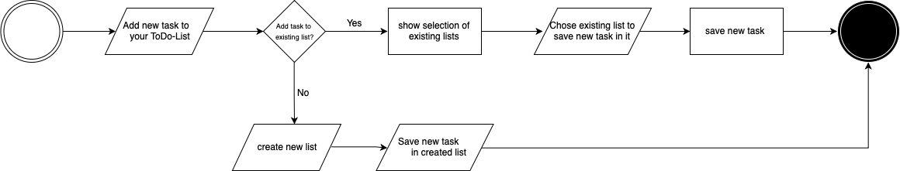

# prog2

## Meine Projekt-Idee: ToDo-Liste "What's on your Mind?"

### Ausgangslage

Eine **ToDo-Liste** ist der Klassiker, um Dinge produktiver zu erledigen und nicht zu vergessen. Solche Listen helfen Ordnung im Chaos zu schaffen, erleichtern das Erinnern und verhindern bestenfalls das «Vor sich herschieben». Zudem machen sie Spass, und motivieren, wenn nach und nach Aufträge von der Liste gestrichen werden können. 

ToDo-Listen, die früher ausschliesslich mit Papier und Stift erstellt wurden, können heute mithilfe zahlreicher Apps bequem auf dem PC, Ipad oder Smartphone erfasst werden und sind so jederzeit abrufbereit. 

**_Hacken an der ganzen Sache?_**
Will man eine vollumfängliche Applikation, die auf die eigenen Bedürfnisse angepasst ist und auch noch eine schöne Benutzeroberfläche hat, wird meist Geld gefordert. 

Mit meiner Web-Applikation **«What’s on your mind?»** will ich mir Grundlagen zum Programmieren einer Applikation aneignen und eine ToDo-Listen mit Features nach meinen Wünschen konstruieren. 

### Funktion / Projektidee  

Die Applikation sollte zur einfachen Erstellung von Aufgaben-Listen fähig sein. Das Zeit- und Selbstmanagement-Tool dient folglich als Plattform, Aufgaben zu sammeln, nach Relevanz und Datum zu sortieren und abhacken zu können. 
Des Weiteren sollte der Benutzer die Möglichkeit haben, eine Liste mit Inspirationen und Ideen und Terminen (z.B. mittels integriertem Kalender), erstellen zu können. 

### Workflow: 

* #### Dateneingabe
  *	Erstellen verschiedener Listen
  *	Hinzufügen von Elementen zu einer Liste

  ##### Erstellen eines neuen tasks 
  

* #### Datenverarbeitung / Speicherung
  *	Speichern der erstellten Listen / Elemente 
  * Aktualisieren eines Elements in der Liste
  *	Löschen eines Elements aus der Liste
  
  
* #### Datenausgabe 
  *	Ausgabe der Listen als Word- oder PDF-Dokument zum Downloaden oder Drucken 

